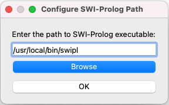
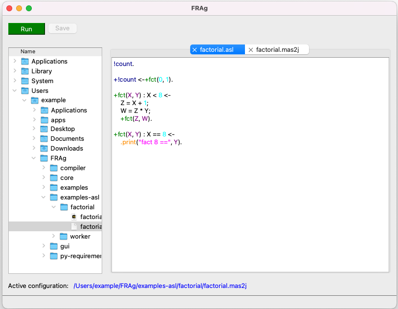
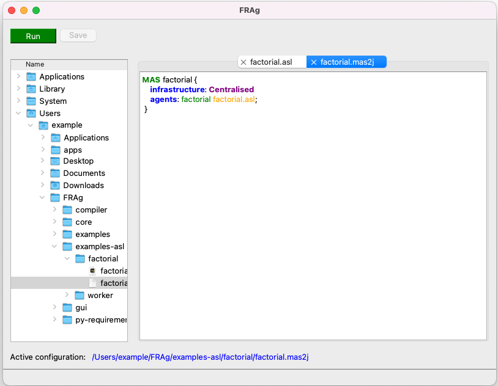
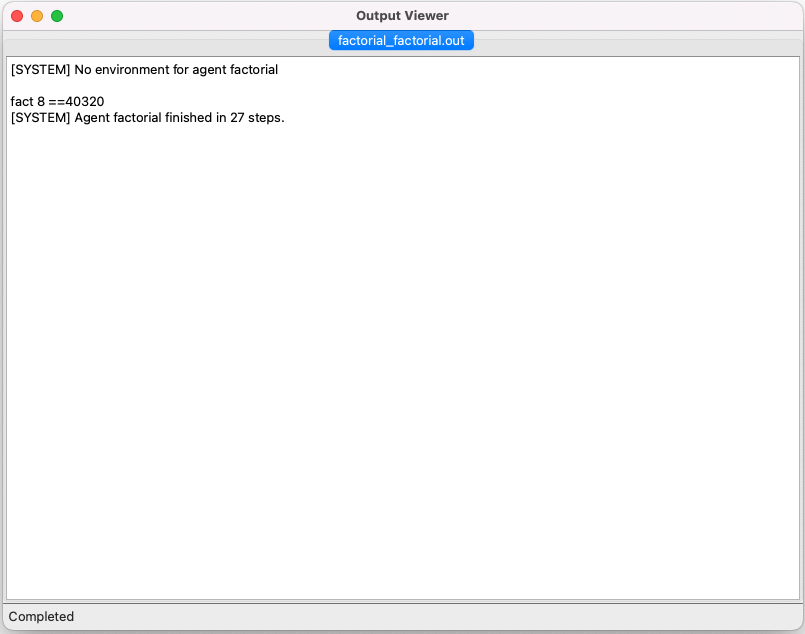

# FRAg: Flexibly Reasoning BDI Agent

This repository contains the FRAg system - an AgentSpeak(L) [[4]](#4) interpreter using the late variable bindings
strategy
implemented in [SWI Prolog](https://www.swi-prolog.org/).

The system is still under development and is currently in the "alpha" version.
For more detailed information, please refer to our paper [[1]](#1) published at
the [ICCART 2024](https://icaart.scitevents.org/?y=2024) conference.

Additionally, an extended version of this work can be found in our upcoming paper [[2]](#2), accepted for publication in
*Lecture Notes in Artificial Intelligence* in 2025.

Furthermore, a related study was presented at the [ICCART 2025](https://icaart.scitevents.org/?y=2025)
conference [[3]](#3).

## How to set up and run FRAg

### 1. Install SWI Prolog

Before running FRAg, you need to install [SWI Prolog](https://www.swi-prolog.org/). The installation process varies
depending on your operating system.

**Linux (Ubuntu/Debian)**

```bash
sudo add-apt-repository ppa:swi-prolog/stable
sudo apt-get update
sudo apt-get install swi-prolog
```

**Linux (Fedora/RHEL/CentOS)**

```bash
sudo dnf install pl
```

**Windows**

1. Download and install [SWI Prolog](https://www.swi-prolog.org/Download.html).
2. After installation, verify it by running `swipl` in the command prompt. If installed correctly, you should see the
   Prolog prompt (`?-`).

---

### 2. Clone the FRAg Repository

You can clone FRAg from GitHub using the following command:

```bash
git clone https://github.com/VUT-FIT-INTSYS/FRAg.git
```

This command works for both **Linux and Windows (PowerShell/CMD)**.

---

### 3. Run FRAg

Navigate to the directory where FRAg was cloned and start the interpreter:

```bash
cd FRAg
swipl core/FRAgPL.pl
```

Then, in the Prolog shell, run the agent:

```prolog
?- frag('../examples/trader/trader').
```

The output will be stored in `examples/trader/*.out`, with the exact filename depending on the configuration defined in
`examples/trader/trader.mas2fp`.

---

## Program description

The program consists of agent code and a multiagent system setting.

### Agent code (examples\trader\trader.fap)

This file contains a procedure to run and analyse the examples we presented at the
[ICCART 2024](https://icaart.scitevents.org/) conference.
The program on which we tested the parameters of its execution with early or late bindings involved
a souvenir (card) shop. The shopkeeper sold cards to interested buyer if there were
a matching seller offering the desired card at a price acceptable to the buyer. More details are given
in the article[[1]](#1).

The code of such an agent in AgentSpeak(L) would be as follows:

```
+!sell : wants(Buyer, CD, MAX_Price)
    <- ?offers(Seller, CD, Price);
       Price<=Max_Price;
       sell(Seller, Buyer, CD, Price);
       !sell.
```

In FRAg, this program is written in the AgentSpeak(L) dialect suitable for interpretation in Prolog.
Specifically, similar code with a few modifications is created as follows:

```          
plan(ach,
     sell,                        
     [not(closed),buyer(Buyer, CD, Buy_Price)], 
     [
	test(seller(Seller, CD, Sel_Price)),
       	rel(Buy_Price > Sel_Price),
        act(card_shop, sell(Seller, Buyer, CD)),
        act(printfg(
            '~w selling ~w CD ~w for ~w', 
            [Seller, Buyer, CD, Sel_Price])),
        ach(sell)
     ]).
```

The first change is in the contextual conditions of the plan. Because of the trading termination at some
point, we use the query not(closed). Atom `closed` is add to the agent's belief base when a deal is closed.
The agent receives this atom from the environment it is assigned to at initialization. Therefore, also included
in the code is a second plan definition for the same `sell` event, which will tell the agent if the `closed`
atom exists in its belief base will terminate.

```
plan(ach,
     sell,                        
     [closed], [
       act(printfg('It is closed, finish'))]).
```

### Multiagent system settings (examples\trader\trader.mas2fp)

The settings for the multi-agent card trading system can be found in the `trader.mas2fp` file. This extension is used
by FRAg as the default for metafiles representing a population of agents, binding them to environments along with
setting parameters for both types of these elements, which together form the multiagent system.
The code is listed below

```
% a,
include_environment("environments/shop/shop.pl").

% b,
set_agents([(control, terminate(timeout, 1000)),
             (bindings, early),
             (reasoning, random_reasoning),
             (environment, card_shop)]).		

% c,
set_environment(card_shop, [(closing, 750), (s_lambda, 0.1), (b_lambda, 0.1), 
                            (b_price,[0.4, 0.2]), (s_price, [0.6, 0.2]),
                            (products, [8, 0.3, 0.1]), 
                            (episoding, sim_time) ]).

% d,
load("paul","../examples/trader/trader",1,[(debug, systemdbg), (debug, reasoningdbg)]).
load("peter","../examples/trader/trader",1,[(debug, systemdbg), (bindings, late), (debug, reasoningdbg)]).
```

This code is interpreted by the FRAg system and the following is done:

### Load environment (a)

The environment is loaded from the file `core/environments/shop/shop.pl`. This file is a PROLOG module
called `card_shop` and the name of this module still represents it in the FRAg system.
This environment will simulate everything needed for a trading agent and is described later in this text.

### Sets the default agent parameters (b)

Each subsequent agent loaded, if these parameters are not predefined in its definition
below, will have them set as specified in the parameter list in the atom `set_agents(List_Of_Parameters)`.
Specifically, the following is set here:

1. The agent terminates after 1000 iterations in the control loop.
   The strategy for binding variables during agent execution is `early`.
2. The choice of a plan as a means of event processing, intention for execution, and substitutions when multiple
   substitutions are possible is random (the last choice only makes sense in the case of early bindings).
3. Each agent is placed in the `card_shop` environment.

For initial experimentation with this example, we recommend not changing these parameters.

### Sets the parameters of the environment (c)

In this case the `card_shop` environment, to which agents will be deployed.
What parameters can be set depends on the implementation of the environment and can be different for each environment.
The following are set here.

### Load agents (d)

Two agents will be uploaded (since the second term of the `load` atom is 1) named Peter and Paul. If the second term
is greater than one, more agents would be loaded with the prefix *Peter* or *Paul* followed by a number from 1 upwards.
The debug statements (as pairs (key, value) ) are set in the list, both system and reasoning progress when interpreting
the agent, these pairs can be removed and then the listing will be brief and will only contain what the agents send
to the console for printing. Agent *Peter* has overridden the setting of working with variables to 'late'
and therefore does not use the default `early`.

## Extended Examples

In addition to the original example from the ICCART 2024 paper [[1]](#1), FRAg provides several extended examples
demonstrating the flexibility and capabilities of the system. These examples explore more complex scenarios, including
failure handling and advanced decision-making algorithms.

### Worker with Failure Handling

This example demonstrates the use of **failure handling** mechanisms inspired by **Conceptual Agent Notation (CAN)** [[5]](#5). 
In this scenario, agents are equipped with the ability to handle failures during the execution of their
plans. If a failure occurs, the agent can attempt to recover, which is crucial
for improving robustness in dynamic environments.

You can find this example in the `examples/worker` directory.

### Task Maze with SP-MCTS and SA Algorithms

This example, published in [[3]](#3), demonstrates the use of **Single-Player Monte Carlo Tree Search (SP-MCTS)** [[6]](#6), 
integrated with **Action-Level Intention Selection (SA)** algorithms [[7]](#7). In this case, SP-MCTS
is used to help agents make decisions and plan actions in a maze-like environment. In this case, SP-MCTS helps agents 
make decisions and plan actions in a maze-like environment.

The following parameters can be configured to adjust the algorithm’s performance:

- **Alpha (α)**: Determines the number of node expansions performed during the search.
- **Beta (β)**: Specifies the number of simulations conducted at each iteration.
- **Max Steps**: The maximum number of simulation steps to limit the tree search.

These parameters can be set via `set_agents`, using the following syntax:

```prolog
set_agents([(reasoning_params, mcts_params(10,20,40))]).
```

Where `10` represents **Alpha (α)**, `20` represents **Beta (β)**, and `40` is the **maximum number of steps** in the
simulation.

The example can be found in the `examples/task_maze` directory, where the agent attempts to navigate through a maze
using SA-based decision-making processes.

## Output description

Each agent has its own `.out` file into which the agent's entire state is logged for each iteration of
the interpreter loop.

```

[RSNDBG] STATE IN LOOP 2

:: vvvvvvvvvvvvvvvvvvvvvvvvvv
:: Name:paul
:: LOOP 2
:: INTENTIONS: No intentions
:: EVENTS {
event(1,ach,sell,null,[[]],active,[]);
}
:: BELIEFS {
fact(product(cd1,100));
fact(product(cd2,80));
fact(product(cd3,68));
fact(product(cd4,110));
fact(product(cd5,50));
fact(product(cd6,90));
fact(product(cd7,110));
fact(product(cd8,55));
fact(product(cd9,150));
fact(stats_([sold([sold(peter,0),sold(paul,0)]),buyers(0),sellers(0)]));
fact(episode(3));
fact(seller(seller1,cd1,3));
}
:: ^^^^^^^^^^^^^^^^^^^^^^^^^^

```

In the above example, we can see that agent *paul* in the second iteration has no intention yet.
However, an event has occurred - the agent has been given an achievement goal `sell`.
In the agent's belief base, there is information about the products and their prices, what the current episode is
and that a seller named `seller1` wants to buy `cd1` for a price of 3.

```

...
fact(closed);
fact(episode(751));
}
:: ^^^^^^^^^^^^^^^^^^^^^^^^^^

[SYSDBG] Agent paul finished in 458 steps.

```

The file contains logs in the same format until atom `closed` appears in the belief base and
the simulation is terminated.

## Compiler Overview

The compiler was developed using ANTLR (https://www.antlr.org/), a powerful tool for generating parsers and lexers from
grammar specifications. In this case, it translates the AgentSpeak(L) language into the Prolog dialect.

Since the system is still under development, the compiler currently supports basic constructs of AgentSpeak(L), but more
advanced features, such as those found in the [Jason framework](https://jason-lang.github.io/), are not yet supported.

The compiler was written using Python 3.11. You can find installation instructions for Python for your system
on [python.org](https://www.python.org/).

To install the necessary dependencies, use the `requirements.txt` file located in the `py-requirements/` directory.

It is good practice to create a virtual environment (venv) for your project to avoid conflicts with other Python
packages. A virtual environment isolates your project’s dependencies from the global Python installation. To set it up,
use the following commands:

1. Create the virtual environment:
   ```bash
   python -m venv venv
   ```

2. Activate the virtual environment:
    - **Windows (PowerShell):**
      ```bash
      .\venv\Scripts\activate.ps1
      ```
    - **Windows (CMD):**
      ```bash
      .\venv\Scripts\activate.bat
      ```
    - **Linux/macOS (Bash):**
      ```bash
      source venv/bin/activate
      ```

3. Install the required dependencies:
   ```bash
   pip install -r py-requirements/requirements.txt
   ```

### Example Usage

Examples are provided in the `examples-asl/` folder. Currently, there are two examples:

- **Factorial**: Calculates the factorial of 8.
- **Task Maze**: Example from the publication [[3]](#3).

To run the compiler, use the following command:

```bash
python -m compiler examples-asl/factorial/factorial.mas2j compiled/factorial
```

This will compile the `factorial.mas2j` file, including the agents and related components, and store the result in the
`compiled/factorial` folder.

Afterward, navigate to the core directory and run the following command:

```bash
cd core
swipl -l FragPL.pl -g "frag('../compiled/factorial/factorial')" -g halt
```

Once the compiler is run, the program will be executed, and the output will be available in the specified directory.

### Changes to `.mas2j` File Format

The original `.mas2j` file format did not support default agent settings, specifically the atom `set_agents`. To address
this, we introduced a new section called `agent_defaults`. For simplicity, options are now directly received in Prolog
notation.

Similarly, agent definitions have been updated. In the original format, options were received as key-value pairs; here,
we accept Prolog-style notation.

Another modification is in the `environment` section, which now consists of the name, the path to the Prolog file, and
optional options.

The configuration for the system described in the
section [Multiagent system settings](#multiagent-system-settings-examplestradertradermas2fp) would look like this:

```plaintext
MAS trader {
    infrastructure: Centralised
    environment: card_shop "environments/shop/shop.pl" [
        (closing, 750), 
        (s_lambda, 0.1), 
        (b_lambda, 0.1), 
        (b_price,[0.4, 0.2]),
        (s_price, [0.6, 0.2]),
        (products, [8, 0.3, 0.1]), 
        (episoding, sim_time)
    ]    
    agent_defaults: [
        (control, terminate(timeout, 1000)),
        (bindings, early),
        (reasoning, random_reasoning),
        (environment, card_shop)
    ]
    agents:
        paul trader.asl [(debug, systemdbg), (debug, reasoningdbg)];
        peter trader.asl [(debug, systemdbg), (bindings, late), (debug, reasoningdbg)];
 }
```

While we acknowledge that these changes deviate from the original definition, they were made to better suit the ongoing
development of the system.

## User Interface for Managing the Compilation and Execution

The application is built using [PyQt6](https://www.riverbankcomputing.com/software/pyqt/) and provides a simple user
interface to manage the compilation and execution. The required dependencies are included in the same file as the
compiler. The application is started with the following command:

```bash
python main.py
```

Upon the first run, the application will prompt for the path to **SWI-Prolog**, as shown in the image below:



The user can either manually enter the path or use the "Browser" button to select it. To find the path on different
systems, use the following commands:

- **Windows**:
  Open Command Prompt and enter:
  ```bash
  where swipl
    ```
- **Linux/macOS**:
- Open Terminal and enter:
  ```bash
  which swipl
  ```

Once the path is provided, it is validated and saved in the `config.json` configuration file. On subsequent launches,
the path is automatically loaded.

The application features a **tree view** and allows users to open `.asl` and `.mas2j` files. Each file is opened in a
new tab. The editor supports code editing and saving. Additionally, the editor provides basic **syntax highlighting**,
as shown in the images below:




By clicking the **Run** button, the program is compiled and executed. Based on the active tab, the corresponding
configuration in the `.mas2j` file, along with the associated `.asl` files, is compiled into a temporary directory.
Subsequently, the FRAg process is initiated. The output is displayed in the "Output Viewer," which is shown in the image
below. Each agent has a dedicated tab displaying its output file, and the output is updated every second.



The process is indicated by an animation in the bottom-left corner. Once the FRAg process successfully completes, a "
Completed" message will appear.
If the **Output Viewer** is closed or in the event of an error, the temporary directory is automatically deleted.

This interface provides a convenient way to manage the compilation, execution, and real-time output of AgentSpeak(L)
programs, streamlining the development process and offering a seamless user experience.

## References

<a id="1">[1]</a>
VÍDEŇSKÝ František, ZBOŘIL František, BERAN Jan, KOČÍ Radek and ZBOŘIL František V.. Comparing Variable Handling
Strategies in BDI Agents: Experimental Study. In: Proceedings of the 16th International Conference on Agents and
Artificial Intelligence - Volume 1. Rome, 2024, s. 25-36. ISBN 978-989-758-680-4.

<a id="2">[2]</a>
VÍDEŇSKÝ František, ZBOŘIL František, KOČÍ Radek and ZBOŘIL František V.. Advanced evaluation of variable binding
strategies in BDI agents with integrated failure handling. Lecture Notes in Artificial Intelligence, 2025. Accepted for
publication.

<a id="3">[3]</a>
VÍDEŇSKÝ František, ZBOŘIL František, and VEIGEND Petr. Comparing Variable Handling Strategies in BDI Agents:
Experimental Study. In: Proceedings of the 17th International Conference on Agents and Artificial Intelligence, 2025 .
Accepted for publication.

<a id="4">[4]</a>
RAO, Anand S. AgentSpeak (L): BDI agents speak out in a logical computable language. In: European workshop on modelling
autonomous agents in a multi-agent world. Berlin, Heidelberg: Springer Berlin Heidelberg, 1996. p. 42-55.

<a id="5">[5]</a>
SARDINA, Sebastian; PADGHAM, Lin. A BDI agent programming language with failure handling, declarative goals, and
planning. Autonomous Agents and Multi-Agent Systems, 2011, 23: 18-70.

<a id="6">[6]</a>
SCHADD, Maarten PD, et al. Single-player monte-carlo tree search. In: Computers and Games: 6th International Conference,
CG 2008, Beijing, China, September 29-October 1, 2008. Proceedings 6. Springer Berlin Heidelberg, 2008. p. 1-12.

<a id="7">[7]</a>
YAO, Yuan; LOGAN, Brian. Action-level intention selection for BDI agents. In: Proceedings of the 2016 International
Conference on Autonomous Agents & Multiagent Systems. 2016. p. 1227-1236.
